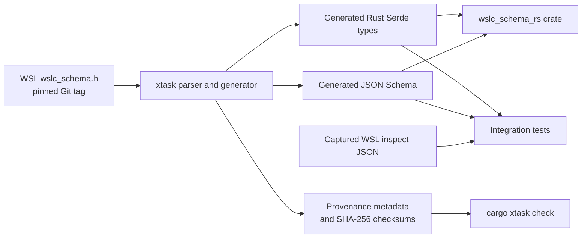

# wslc_schema_rs

`wslc_schema_rs` is a Rust crate that provides idiomatic, strongly typed
[Serde](https://serde.rs/) models for container JSON documents described by
Microsoft WSL's `wslc_schema.h`.

The public API uses Rust naming conventions (`snake_case` fields and
`UpperCamelCase` types), while Serde preserves WSL's original JSON property
names during serialization and deserialization. The crate has no runtime
dependencies beyond Serde and forbids unsafe Rust.

## Versioning and source provenance

The crate version's build metadata identifies the matching WSL release. For
example, `0.1.0+2.9.3` is generated from the `2.9.3` WSL tag. Generated output
is committed with its source metadata and SHA-256 checksums, allowing normal
builds and tests to run without network access.

| Path | Purpose |
| --- | --- |
| `wslc_schema_rs/src/` | Public crate entry point and hand-written behavior. |
| `wslc_schema_rs/generated/` | Committed Rust types, JSON Schema, provenance, and checksums. |
| `wslc_schema_rs/tests/fixtures/` | Captured WSL inspect output used by integration tests. |
| `xtask/` | Schema parser and deterministic artifact generator. |

## How it works



The generator is used only when updating the pinned WSL schema. Consumers build
from the committed generated artifacts; `cargo xtask check` confirms that the
types, metadata, and checksums still agree.

## Getting started

Add the crate and Serde JSON support to an application:

```toml
[dependencies]
serde_json = "1"
wslc_schema_rs = "0.1"
```

Deserialize an inspect document using its generated type:

```rust
use wslc_schema_rs::InspectContainer;

let document: InspectContainer = serde_json::from_str(json_text)?;
println!("{}", document.name);
```

The generated JSON Schema is also available in the published crate at
`generated/wslc_schema.schema.json`.

## Development

This repository is a Cargo workspace containing the published
`wslc_schema_rs` crate and a private `xtask` generator. Run the standard
validation suite before submitting changes:

```powershell
cargo fmt --all -- --check
cargo clippy --workspace --all-targets --all-features -- -D warnings
cargo test --workspace --all-features --locked
cargo xtask check
cargo deny check
```

## Regenerating artifacts

Do not edit files under `wslc_schema_rs/generated/` manually. Regenerate every
artifact from the WSL tag encoded in `Cargo.toml`:

```powershell
cargo xtask generate
cargo xtask check
```

`generate` fetches the pinned WSL Git tag. To generate from a local header
instead, run `cargo xtask generate --header PATH`. Use
`cargo xtask check --upstream` to fetch the pinned tag and verify the committed
artifacts are exactly reproducible.

## Releases

Release preparation happens on `release/<crate-version>` branches. The release
workflow requires the branch version and pushed tag `v<crate-version>` to match
the crate version exactly, including WSL build metadata. It validates tests,
generated artifacts, upstream reproducibility, and a crates.io dry run before
publishing.

## Contributing and license

See [CONTRIBUTING.md](CONTRIBUTING.md) for the contribution workflow,
[SECURITY.md](SECURITY.md) for private vulnerability reporting, and
[CODE_OF_CONDUCT.md](CODE_OF_CONDUCT.md) for community standards.

Licensed under either of [Apache License, Version 2.0](LICENSE-APACHE) or
[MIT license](LICENSE-MIT), at your option.
